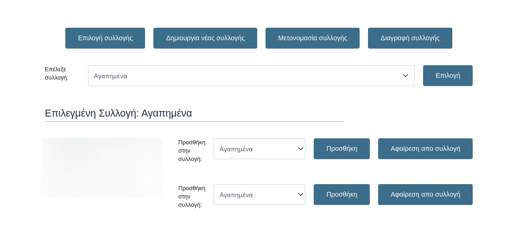
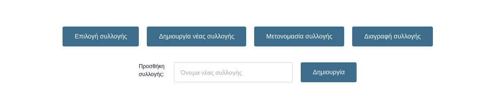
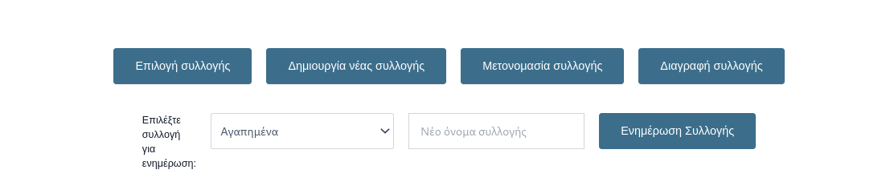
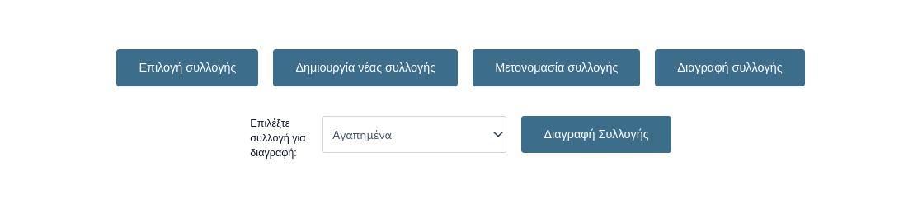
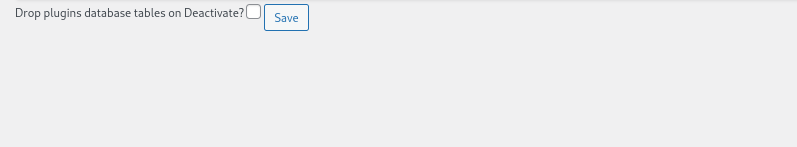

[](https://intermediakt.org)
[](https://www.php.net/downloads.php)
[](https://wordpress.org/download/releases/6-7/)


## Author
Created by [Charalambos Rentoumis](https://github.com/5skr0ll3r)

## Overview
The **IMKT Collection Plugin** is a WordPress plugin that enhances the WooCommerce platform by adding a library-style feature for managing product collections. This document provides a detailed overview, and explanations of key components and their functionality.

## Why
This plugin was created to fill the need for a user friendly and free way of having a collections type mechanism for woocommerce products where a user can easily manage his favourite products within user defined lists.


## Screenshots



In this menu you may a selection to see it's entries.



Add a new collection.



Rename a collection.



Delete a collection.


This button will add the product to the selected collection and is displayed in the single product page.



The admin panel only contains one setting which is to drop or not to drop the plugins tables for clean up
on deactivation.

## Add Menu Entry
To add the collections menu option in your sites menu bar go in:
`Dashboard -> Appearance -> Customize -> Menus -> Select your menu -> press "Add Items" and click the Συλλογές or however you have named it` and publish.


# Docs

## File Structure
```
.
└── collection/
    ├── index.php
    ├── collection_plugin.php
    ├── includes/
    │   ├── index.php
    │   ├── collection_plugin_activate.php
    │   ├── collection_plugin_db_api.php
    │   ├── collection_plugin_deactivate.php
    │   └── collection_plugin_template_loader.php
    └── templates/
      ` ├── admin/
        │   ├── index.php
        │   └── settings_page.php
        ├── index.php
        ├── collection_page_template.php
        ├── collection_product_preview_button.php
        └── collection_single_product_button.php
```

## Plugin Metadata
- **Plugin Name**: Collection Plugin
- **Description**: Adds a library-like feature for WooCommerce.
- **Version**: 1.0.0
- **Author**: Charalambos Rentoumis (5skr0ll3r)
- **WP Requires At Least**: 6.0
- **WP Tested Up To**: 6.7
- **WC Requires At Least**: 6.0
- **WC Tested Up To**: 6.6.2
- **License**: Attribution-ShareAlike 4.0 International
- **License URI**: [Attribution-ShareAlike 4.0 International](https://creativecommons.org/licenses/by-sa/4.0/)

## Global Variables
- `PLUGIN_DIR_PATH`: **String** – Full path to the plugin directory.
- `DEFAULT_COLLECTION_NAME`: **String** – Default collection name (`Αγαπημένα`).
- `COLLECTIONS_DISPLAY_PAGE`: **String** – Name for the collections display page (`Συλλογές`).
- `DROP_COLLECTIONS_TABLES`: **Boolean** – Controls whether to drop plugin database tables on deactivation (`false`).

## Key Hooks
- `register_activation_hook`: Registers the plugin activation function.
- `register_deactivation_hook`: Registers the plugin deactivation function.
- `add_action('init')`: Initializes the plugin.
- `add_action('admin_menu')`: Adds a custom menu item in the admin dashboard.
- `add_action('woocommerce_after_shop_loop_item')`: Adds a custom button on the product preview.
- `add_action('woocommerce_product_meta_end')`: Adds a custom button on the single product page.

---

## Class: IMKT_Collection_Plugin

### Properties
- **`$coldb`**: **Object** – Instance of `IMKT_Collection_Plugin_DB_API` used for interacting with the database.
- **`$template_loader`**: **Object** – Instance of `IMKT_Plugin_Template_Loader` used for loading templates for collection management.

### Methods

#### `__construct()`
- **`Description`**: Initializes the plugin, loading necessary classes and setting up hooks for the plugin's functionality.

#### `activate()`
- **Description**: Static method triggered on plugin activation. It calls `IMKT_Collection_Plugin_Activate::activate()` to set up initial plugin configurations.

#### `deactivate()`
- **Description**: Static method triggered on plugin deactivation. It calls `IMKT_Collection_Plugin_Deactivate::deactivate()` to remove any changes made during activation.

#### `add_custom_button_on_product_preview()`
- **Description**: Adds a custom button on the WooCommerce product preview page.
- **Template**: This functionality requires the `collection_product_preview_button.php` template to render the button correctly.

#### `add_custom_button_on_single_product()`
- **Description**: Adds a custom button on the single product page.
- **Template**: This functionality requires the `collection_single_product_button.php` template for displaying the button.

#### `add_menu_item()`
- **Description**: Adds a custom menu item to the WordPress admin dashboard under the title "Collection", allowing the user to manage collections.
- **Action**: This menu item points to the `render_settings` method, where the settings page will be displayed.

#### `render_settings()`
- **Description**: Renders the settings page for the plugin in the WordPress admin dashboard.
- **Template**: This functionality requires the `settings_page.php` template to manage plugin settings.

## Setup and Installation

1. **Activate the Plugin**: After installing the plugin, activate it using the WordPress dashboard.
2. **Settings**: Once activated, access the plugin settings through the "Collection" menu in the WordPress admin dashboard.
3. **Customization**: If needed, modify the templates provided with the plugin (such as `collection_product_preview_button.php`, `collection_single_product_button.php`, and `settings_page.php`) to fit the theme and design requirements of your website.

---

## IMKT Collection Plugin Activation
`includes/collection_plugin_activate.php`
### Overview
The **IMKT_Collection_Plugin_Activate** class handles the activation process of the IMKT Collection Plugin, setting up necessary database tables and initializing collections.

### Class: `IMKT_Collection_Plugin_Activate`

#### Methods

##### `activate()`
- **Description**: Triggered during plugin activation. Calls `IMKT_Collection_Plugin_Activate::activate()` to set up collections and flush rewrite rules.

##### `init_collection()`
- **Description**: Initializes the necessary database tables and sets up the collections display page. Ensures required database structures are in place.

---

## IMKT Collection Plugin Deactivation
`includes/collection_plugin_deactivate.php`
### Overview
The **IMKT_Collection_Plugin_Deactivate** class handles deactivation tasks, such as removing the collections display page and optionally dropping the plugin's database tables.

### Class: `IMKT_Collection_Plugin_Deactivate`

#### Methods

##### `deactivate()`
- **Description**: Triggered on deactivation. Removes the collections page, drops database tables if necessary, and flushes rewrite rules.

---

## IMKT_Collection_Plugin_DB_API
`includes/collection_plugin_db_api.php`
### Overview
The **IMKT_Collection_Plugin_DB_API** class manages database operations related to user collections, including adding, updating, and removing entries.

### Class: `IMKT_Collection_Plugin_DB_API`

#### Properties
- **`$coldb_prefix`**: **String** – Prefix for custom tables related to collections.
- **`$site_prefix`**: **String** – Prefix for WordPress installation tables.
- **`$prefix`**: **String** – Combination of `$site_prefix` and `$coldb_prefix` for custom table prefixes.
- **`$queries`**: **Array** – Stores SQL queries used to interact with the collections database.

#### Methods

##### `__construct()`
- **Description**: Initializes the class by setting up the necessary table prefixes and preparing the SQL queries.

##### `is_collection_owner($collection_id)`
- **Description**: Checks if the current user owns the specified collection.

##### `list_collections()`
- **Description**: Retrieves a list of collections for the current user.

##### `get_collection($collection_id)`
- **Description**: Retrieves a collection's details by its ID for the current user.

##### `find_default_users_collection_id()`
- **Description**: Finds or creates the default collection ID for the current user.

##### `collection_entry_exists($book_id, $collection_name_id)`
- **Description**: Checks if a book is already in a specified collection.

##### `insert($book_id, $collection_name_id)`
- **Description**: Adds a book to a collection.

##### `remove($entry_id)`
- **Description**: Removes a book from a collection.

##### `collection_name_exists($collection_name_id, $collection_name)`
- **Description**: Checks if a collection name exists for the current user.

##### `get_name($collection_id)`
- **Description**: Retrieves the name of a collection by its ID.

##### `insert_name($collection_name)`
- **Description**: Adds a new collection for the user.

##### `update_name($entry_id, $new_name)`
- **Description**: Updates the name of a collection.

##### `remove_name($collection_id)`
- **Description**: Deletes a collection.

---

## IMKT_Plugin_Template_Loader
`includes/collection_plugin_template_loader.php`
### Overview
The **IMKT_Plugin_Template_Loader** class handles the loading and rendering of templates for the IMKT plugin.

### Class: `IMKT_Plugin_Template_Loader`

#### Methods

##### `get_template($template_name, $coldb)`
- **Description**: Loads a template file from the plugin’s `templates` directory.
- **Parameters**:
  - `$template_name` (string): The name of the template file to load (without the `.php` extension).
  - `$coldb` (mixed): Additional parameter passed for use within the template.
- **Behavior**:
  - Checks if the user is logged in; redirects to login if not.
  - Includes the template file if it exists, or shows a "Template not found" message if it does not.

---

## Template for Managing User Collections
`templates/collection_page_template.php`
### Overview
This template allows users to manage their collections by creating, updating, and deleting them, as well as managing books within those collections.

### Template Variables
- **$default_collection_id**: The user's default collection ID.
- **$user_collections**: An array of collections for the user.
- **$active_menu_option**: Current menu option for managing collections.
- **$action_response**: Displays a message about the action result.
- **$collection_id**: The selected collection ID.

### Functional Flow
1. **Menu Options**: The menu allows users to select actions like creating, renaming, or deleting collections.
2. **POST Requests**: The template handles actions like creating, renaming, and deleting collections based on POST data.

### Action Response
- Displays success or error messages after each action.

### Form Handling and Rendering
- Forms are dynamically displayed based on user input and menu selection.

---

## Add Product to Collection Template (Single Page Product)
`templates/collection_single_product_button.php`
### Overview
This template allows users to add a product to one of their collections.

### Functionality
1. **Check if User is Logged In**: Executes only if the user is logged in.
2. **Generate HTML Form**: Includes a button and a dropdown to select a collection.
3. **Process Form Data**: Adds the product to the selected collection.
4. **Display Success/Error Message**: Shows a message based on the result.

### Template Structure
- **HTML Structure**: Form with button and dropdown.
- **Form Handling**: Handles the form submission and adds the product to the collection.
- **Message Display**: Displays feedback to the user.

---

## Add Product to Favorites Button (Product Preview)
`templates/collection_product_preview_button.php`
### Overview
This template allows users to add a product to their "favorites" collection.

### Functionality
1. **Check if User is Logged In**: Executes only if the user is logged in.
2. **Generate Button**: Displays a button to add the product to "favorites".
3. **Button Action**: Adds the product to the "favorites" collection if not already added.
4. **Check Product in Favorites**: Displays a message if the product is already in "favorites".

### Template Structure
- **HTML Structure**: Button or message based on whether the product is in favorites.
- **Form Handling**: Handles button click and adds product to "favorites".
- **Message Display**: Feedback displayed after the action.

---

## PHP Code for Deactivating Plugin and Dropping Tables Option
`templates/admin/settings_page.php`
### Overview
The following functionality provides an admin interface that allows the site administrator to control whether plugin database tables are dropped upon deactivation. This is controlled through a simple form displayed in the WordPress admin area.

### Functionality:
1. **Form Display**: A form is displayed with a checkbox to allow the administrator to choose whether the plugin’s database tables should be dropped when deactivated.
2. **Form Submission**: When the form is submitted, the option to drop the tables is saved in the WordPress options table.
3. **Checkbox Behavior**: The checkbox reflects the current option (checked if the option is enabled, unchecked if not) using the `checked()` function.
4. **Database Option**: The option (`to-drop-or-not`) is updated based on the form submission, and it controls whether the database tables are deleted during deactivation.

### Use Case:
- **Admin Control**: Site administrators can choose whether to keep or remove plugin-related data when the plugin is deactivated, providing flexibility in managing database cleanup.

---
